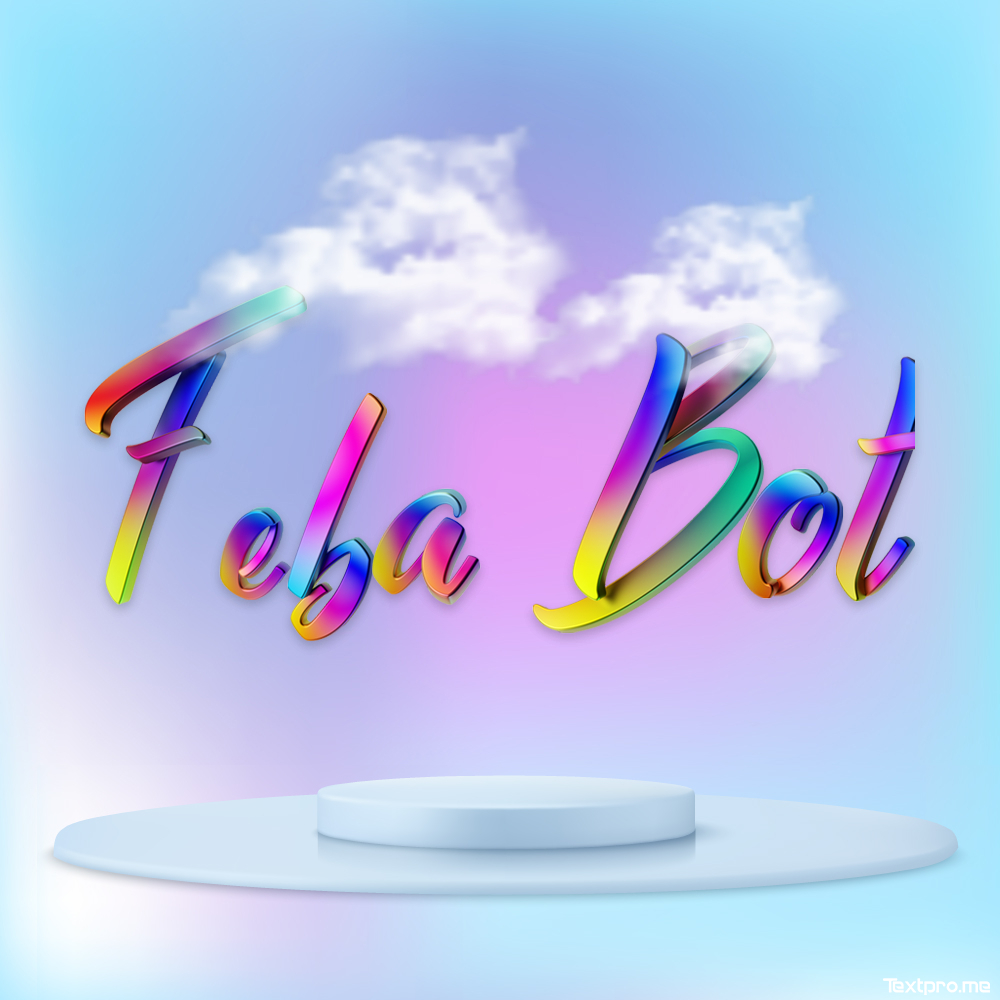

# FEBA BOT

   

 

**SETUP**

 
   <a href="https://replit.com/@Viz-Zer/Feba-QR">
    
 
   <a href="https://heroku.com/deploy?template=https://github.com/Viz-Zer/Feba">
    

## ⓒ 2022 Viz Zer and All other Respective Owners.
